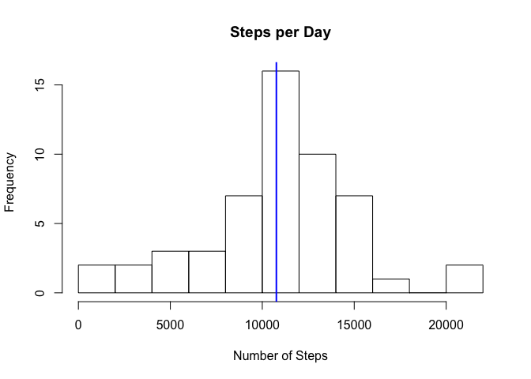
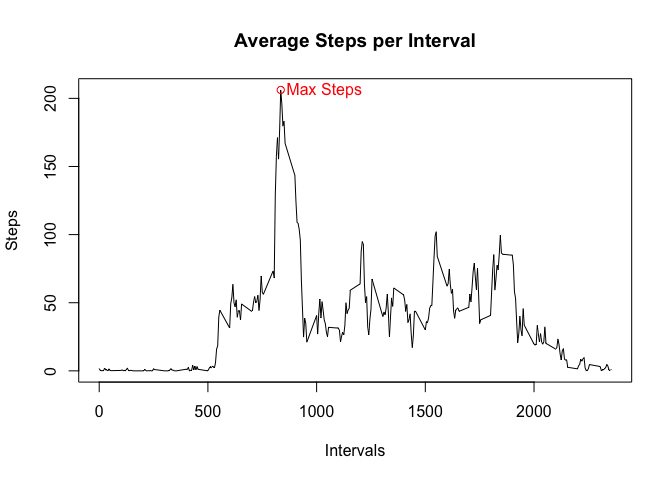
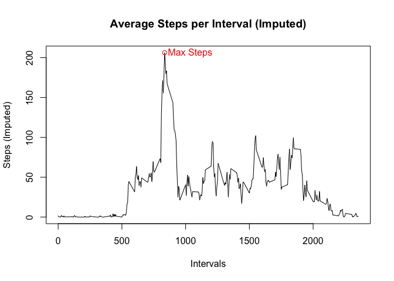
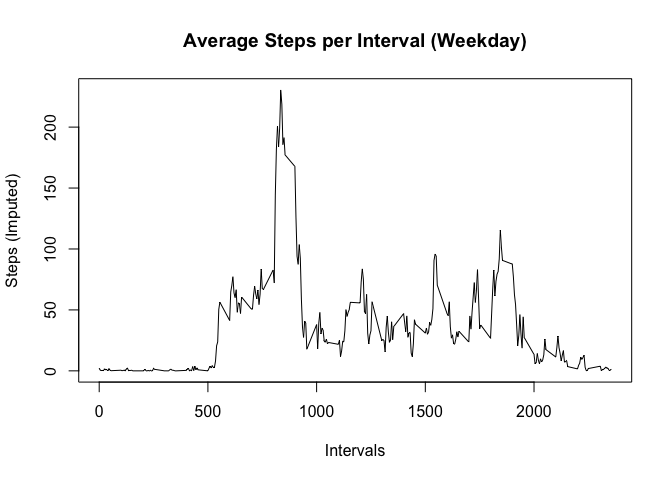

# Reproducible Research: Peer Assessment 1
Himanshu Shrotri  
14 June 2015  

## Summary

This is an R Markdown document created for **"Reproducible Research: Peer Assessment 1"**. This assessment makes use of data from personal activity monitoring device. This device collects data at every 5 mins intervals throughout the day. The data file used here contains data collected for an anonymous individual for 2 months period between October and November 2012.

The assessment will perform analysis of this data and answers below four questions:
- What is mean total number of steps taken per day?
- What is the average daily activity pattern?
- Imputing missing values
- Are there differences in activity patterns between weekdays and weekends?


## Loading and processing the data
The data is provided in a .csv file. This code will do the following:
- Check if the file is already present.
- If not present then download it from the URL provided
- Unzip the file and create the file *activity.csv*
- Read the data in a variable for further processing


```r
# Check if text data file exists, if not then download the zip file and unzip file.
if (!file.exists(dataFile)) {
        print("Project data missing; downloading from source. Please Wait...")
        download.file(zipFileUrl, destfile = zipFile, method = "curl")
        unzip(zipFile, exdir = "./")
}

stopifnot(file.exists(dataFile))

# Read the data from csv file and store it in a variable
activityData <- read.csv("activity.csv")
```


## What is mean total number of steps taken per day?
This piece of code will perform the following:
- Find out total number of steps per day.
- Plot a histogram of steps per day (I will use 12 breaks for better readability).
- Display *Mean* and *Median* of the data


```r
# Find out total number of steps per day
stepsByDate <- aggregate(steps ~ date, activityData, sum, na.rm = TRUE)
meanSteps <- mean(stepsByDate$steps)
medianSteps <- median(stepsByDate$steps)

with(stepsByDate, hist(x = steps
                       , main = "Steps per Day"
                       , xlab = "Number of Steps"
                       , ylab = "Frequency"
                       , breaks = 12))

abline(v = meanSteps, col="blue", lwd=2)
```

 

Mean Steps are 1.0766189\times 10^{4} and Median Steps are 10765

## What is the average daily activity pattern?
This piece of code will perform the following:
- Make a time series plot of the 5-minute interval and the average number of steps taken (y-axis)
- Which 5-minute interval, on average across all the days in the dataset, contains the maximum number of steps?


```r
# Find out total number of steps per day
intervalData <- aggregate(steps ~ interval, activityData, mean, na.rm = TRUE)
intWithMaxSteps <- intervalData[order(intervalData$steps, decreasing = TRUE),][1,]$interval
maxSteps <- round(intervalData[order(intervalData$steps, decreasing = TRUE),][1,]$steps,2)

with(intervalData, plot(x= interval, y = steps
                 , main = "Average Steps per Interval"
                 , xlab = "Intervals"
                 , ylab = "Steps"
                 , type = "l"))

points(intWithMaxSteps, maxSteps, col="red")
text(intWithMaxSteps+200, maxSteps, col="red", labels = "Max Steps")
```

 

There are 206.17 steps for interval 835.

## Imputing missing values
This piece of code will perform the following:
- Make a time series plot of the 5-minute interval and the average number of steps taken (y-axis)
- Which 5-minute interval, on average across all the days in the dataset, contains the maximum number of steps?


```r
# Number of observations with NAs
naObservations <- nrow(activityData[!complete.cases(activityData),])
```

The provided data contains a total of 2304 which are having NAs. Below is the brief on strategy proposed to fill in all the missing values in the dataset. I am using an imputing strategy to replace all NAs with average of steps for that interval.


```r
# imputed steps will be avg of steps by interval
intervalData$imputed_steps <- ceiling(intervalData$steps)

imputedActivityData <- merge(activityData, 
                             intervalData[,c("interval", "imputed_steps")],
                             by="interval")

imputedActivityData$steps <- ifelse(is.na(imputedActivityData$steps),
                                    imputedActivityData$imputed_steps,
                                    imputedActivityData$steps)

imputedIntervalData <- aggregate(steps ~ interval, imputedActivityData, mean)

intWithMaxSteps_imputed <- imputedIntervalData[order(imputedIntervalData$steps, decreasing = TRUE),][1,]$interval
maxStep_imputed <- round(imputedIntervalData[order(imputedIntervalData$steps, decreasing = TRUE),][1,]$steps,2)


with(imputedIntervalData, plot(x = interval, y = steps
                 , main = "Average Steps per Interval (Imputed)"
                 , xlab = "Intervals"
                 , ylab = "Steps (Imputed)"
                 , type = "l"))

points(intWithMaxSteps_imputed, maxStep_imputed, col="red")
text(intWithMaxSteps_imputed+200, maxStep_imputed, col="red", labels = "Max Steps")
```

 

There are 206.28 steps for interval 835.

The impact of imputing the number of steps has a nigligible effect. By the two plots it is clear that missing values have very little bias.

## Are there differences in activity patterns between weekdays and weekends?
This piece of code will perform the following:
- Create a new factor variable in the dataset with two levels -  "weekday" and "weekend" indicating whether a given date is a weekday or weekend day.
- Make a panel plot containing a time series plot (i.e. type = "l") of the 5-minute interval (x-axis) and the average number of steps taken, averaged across all weekday days or weekend days (y-axis).


```r
imputedActivityData$weeks <- factor(
  ifelse(weekdays(as.Date(imputedActivityData$date)) %in% c("Saturday", "Sunday"),
         'weekend', 'weekday'))

# Plot the average steps per interval, given the week_part

weekdayIntervalData <- aggregate(steps ~ interval, subset(imputedActivityData, weeks == "weekday"), mean)
weekendIntervalData <- aggregate(steps ~ interval, subset(imputedActivityData, weeks == "weekend"), mean)

with(weekdayIntervalData, plot(x = interval, y = steps
                 , main = "Average Steps per Interval (Weekday)"
                 , xlab = "Intervals"
                 , ylab = "Steps (Imputed)"
                 , type = "l"))
```

 

```r
with(weekendIntervalData, plot(x = interval, y = steps
                 , main = "Average Steps per Interval (Weekend)"
                 , xlab = "Intervals"
                 , ylab = "Steps (Imputed)"
                 , type = "l"))
```

 


From above it is observed that on weekends there is less activity overall than weekdays.
